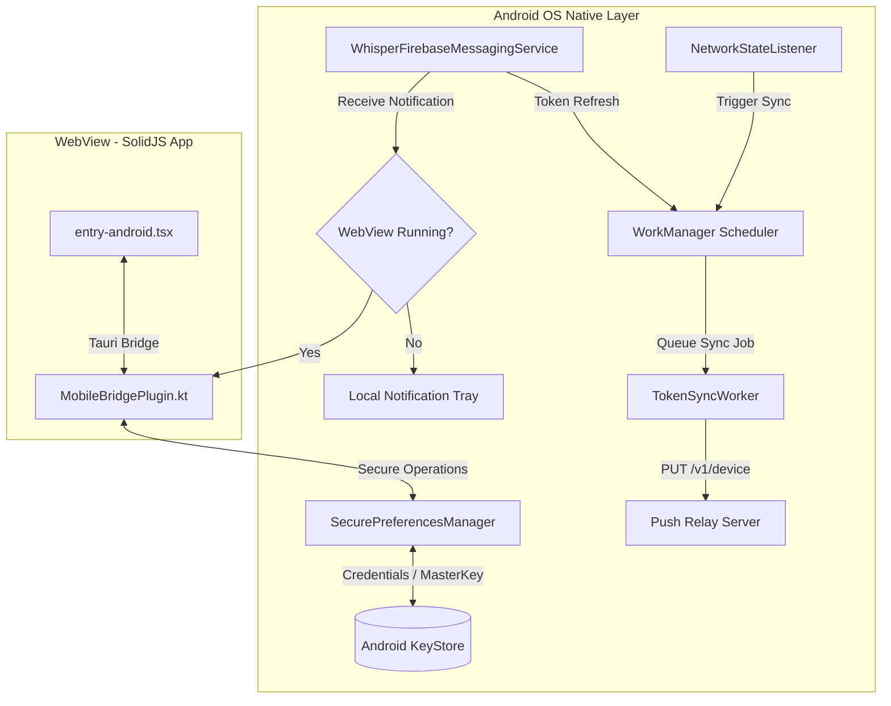

# Design Specification: Robust Android Push Notifications

This document details the robust design and architecture for implementing Android Push Notifications in the WhisperCode codebase. It expands on the basic FCM configuration to prioritize connection-loss resilience, secure credential persistence, and notification handling during background/killed states when the WebView is not running.

---

## 1. Architectural Overview

WhisperCode runs in a Tauri WebView wrapper on Android. To ensure background reliability and robust performance, we partition our design between the foreground SolidJS application and a native Kotlin background processor.



### 1.1 Webview-Independent Push Processing
When a push notification is delivered to the device, the SolidJS/WebView layer may not be running (the app might be backgrounded or force-killed by the OS). The system must handle notification display and decryption entirely in native Kotlin code. When the user taps the notification, the native layer boots or restores the WebView and passes the payload forward.

---

## 2. Secure Persistence Engine

To secure the pairing credentials (`channel_id`, `device_id`, and `device_secret`) against extraction, Android's `EncryptedSharedPreferences` is used. This provides hardware-backed AES-256 encryption using keys managed in the Android KeyStore.

### 2.1 Dependencies Configuration
The `androidx.security:security-crypto` library must be added to the plugin's `build.gradle` or app module's dependencies:

```kotlin
dependencies {
    implementation("androidx.security:security-crypto:1.1.0-alpha06")
}
```

### 2.2 SecurePreferencesManager Implementation
This helper manages secure reading, writing, and KeyStore corruption recovery.

```kotlin
package ai.opencode.mobilebridge

import android.content.Context
import android.content.SharedPreferences
import android.util.Log
import androidx.security.crypto.EncryptedSharedPreferences
import androidx.security.crypto.MasterKey
import java.io.File
import java.security.KeyStore

class SecurePreferencesManager(private val context: Context) {
    companion object {
        private const val TAG = "SecurePrefs"
        private const val SECURE_FILE_NAME = "whisper_secure_prefs"
        
        private const val KEY_CHANNEL = "push.channel"
        private const val KEY_DEVICE = "push.device"
        private const val KEY_SECRET = "push.secret"
        private const val KEY_RELAY_URL = "push.relay_url"
        private const val KEY_PENDING_TOKEN = "push.pending_token"
    }

    private var sharedPreferences: SharedPreferences? = null

    init {
        initializePreferences()
    }

    private fun initializePreferences() {
        try {
            val masterKey = MasterKey.Builder(context)
                .setKeyScheme(MasterKey.KeyScheme.AES256_GCM)
                .build()

            sharedPreferences = EncryptedSharedPreferences.create(
                context,
                SECURE_FILE_NAME,
                masterKey,
                EncryptedSharedPreferences.PrefKeyEncryptionScheme.AES256_SIV,
                EncryptedSharedPreferences.PrefValueEncryptionScheme.AES256_GCM
            )
        } catch (e: Exception) {
            Log.e(TAG, "Failed to initialize EncryptedSharedPreferences. KeyStore may be corrupted.", e)
            handleKeyStoreCorruption()
        }
    }

    /**
     * Recovery logic for KeyStore corruption. Recreating keys and clearing local configuration
     * prevents app crash loops when hardware cryptography state is lost.
     */
    private fun handleKeyStoreCorruption() {
        try {
            // Delete KeyStore entry
            val keyStore = KeyStore.getInstance("AndroidKeyStore").apply { load(null) }
            keyStore.deleteEntry(MasterKey.DEFAULT_MASTER_KEY_ALIAS)
            
            // Delete the preferences file
            val sharedPrefsFile = File(context.filesDir.parent, "shared_prefs/$SECURE_FILE_NAME.xml")
            if (sharedPrefsFile.exists()) {
                sharedPrefsFile.delete()
            }
            
            // Attempt to re-initialize clean preferences
            val masterKey = MasterKey.Builder(context)
                .setKeyScheme(MasterKey.KeyScheme.AES256_GCM)
                .build()

            sharedPreferences = EncryptedSharedPreferences.create(
                context,
                SECURE_FILE_NAME,
                masterKey,
                EncryptedSharedPreferences.PrefKeyEncryptionScheme.AES256_SIV,
                EncryptedSharedPreferences.PrefValueEncryptionScheme.AES256_GCM
            )
            Log.i(TAG, "Successfully recovered from KeyStore corruption. Local credentials reset.")
        } catch (recoveryException: Exception) {
            Log.e(TAG, "Fatal recovery exception during KeyStore corruption recovery", recoveryException)
        }
    }

    fun saveCredentials(channelId: String?, deviceId: String?, deviceSecret: String?) {
        sharedPreferences?.edit()?.apply {
            putString(KEY_CHANNEL, channelId)
            putString(KEY_DEVICE, deviceId)
            putString(KEY_SECRET, deviceSecret)
            apply()
        }
    }

    fun getChannelId(): String? = sharedPreferences?.getString(KEY_CHANNEL, null)
    fun getDeviceId(): String? = sharedPreferences?.getString(KEY_DEVICE, null)
    fun getDeviceSecret(): String? = sharedPreferences?.getString(KEY_SECRET, null)

    fun saveRelayUrl(url: String?) {
        sharedPreferences?.edit()?.putString(KEY_RELAY_URL, url)?.apply()
    }

    fun getRelayUrl(): String = sharedPreferences?.getString(KEY_RELAY_URL, "https://whisper.clankercontext.com") ?: "https://whisper.clankercontext.com"

    fun savePendingToken(token: String?) {
        sharedPreferences?.edit()?.putString(KEY_PENDING_TOKEN, token)?.apply()
    }

    fun getPendingToken(): String? = sharedPreferences?.getString(KEY_PENDING_TOKEN, null)

    fun clearAll() {
        sharedPreferences?.edit()?.clear()?.apply()
    }
}
```

---

## 3. Background Push Service & WebView Lifecycle

Incoming messages are routed through Firebase Cloud Messaging. We handle two main states: the WebView being active (foreground), and the WebView being dormant (backgrounded/killed).

### 3.1 Custom FirebaseMessagingService Configuration

```kotlin
package ai.opencode.mobilebridge

import android.app.NotificationChannel
import android.app.NotificationManager
import android.app.PendingIntent
import android.content.Context
import android.content.Intent
import android.os.Build
import android.util.Log
import androidx.core.app.NotificationCompat
import com.google.firebase.messaging.FirebaseMessagingService
import com.google.firebase.messaging.RemoteMessage
import app.tauri.plugin.JSObject

class WhisperFirebaseMessagingService : FirebaseMessagingService() {
    companion object {
        private const val TAG = "WhisperFCM"
        const val CHANNEL_ID = "opencode_notifications"
        private const val CHANNEL_NAME = "Whisper Notifications"
    }

    override fun onMessageReceived(remoteMessage: RemoteMessage) {
        val payload = remoteMessage.data
        val title = payload["title"] ?: "New Message"
        val body = payload["body"] ?: ""
        val href = payload["href"]
        
        Log.d(TAG, "Notification received: title=$title, body=$body, href=$href")

        val prefs = SecurePreferencesManager(applicationContext)
        val channelId = prefs.getChannelId()
        val deviceSecret = prefs.getDeviceSecret()

        // Validate payload provenance if device is paired
        if (channelId != null && payload["channel_id"] != channelId) {
            Log.w(TAG, "Received message targeting channel mismatch. Ignoring.")
            return
        }

        // Optional Payload Decryption
        val decryptedBody = if (deviceSecret != null && payload["encrypted"] == "true") {
            decryptPayload(body, deviceSecret) ?: body
        } else {
            body
        }

        if (AppLifecycleTracker.isAppInForeground()) {
            // Deliver event straight to the Tauri WebView
            val jsPayload = JSObject().apply {
                put("title", title)
                put("body", decryptedBody)
                put("href", href)
            }
            MobileBridgePlugin.emitPushReceived(jsPayload)
        } else {
            // WebView is not active: render system tray notification
            showSystemNotification(title, decryptedBody, href)
        }
    }

    override fun onNewToken(token: String) {
        Log.i(TAG, "FCM Token rotated: $token")
        val prefs = SecurePreferencesManager(applicationContext)
        prefs.savePendingToken(token)

        // Queue synchronization with the push-relay
        TokenSyncWorker.schedule(applicationContext, token)
    }

    private fun showSystemNotification(title: String, body: String, href: String?) {
        val notificationManager = getSystemService(Context.NOTIFICATION_SERVICE) as NotificationManager

        if (Build.VERSION.SDK_INT >= Build.VERSION_CODES.O) {
            val channel = NotificationChannel(CHANNEL_ID, CHANNEL_NAME, NotificationManager.IMPORTANCE_HIGH).apply {
                description = "Chat and connection alert notifications"
                enableLights(true)
                enableVibration(true)
            }
            notificationManager.createNotificationChannel(channel)
        }

        // Deep linking target activity
        val intent = packageManager.getLaunchIntentForPackage(packageName)?.apply {
            flags = Intent.FLAG_ACTIVITY_SINGLE_TOP or Intent.FLAG_ACTIVITY_CLEAR_TOP
            if (href != null) {
                putExtra("push_href", href)
            }
        }

        val pendingIntent = PendingIntent.getActivity(
            this,
            System.currentTimeMillis().toInt(),
            intent,
            PendingIntent.FLAG_UPDATE_CURRENT or PendingIntent.FLAG_IMMUTABLE
        )

        val notification = NotificationCompat.Builder(this, CHANNEL_ID)
            .setSmallIcon(applicationContext.resources.getIdentifier("ic_notification", "drawable", packageName))
            .setContentTitle(title)
            .setContentText(body)
            .setAutoCancel(true)
            .setPriority(NotificationCompat.PRIORITY_HIGH)
            .setContentIntent(pendingIntent)
            .build()

        notificationManager.notify(System.currentTimeMillis().toInt(), notification)
    }

    private fun decryptPayload(encryptedData: String, secret: String): String? {
        // Implement decryption scheme matched to the Relay Server's AES output format
        return null 
    }
}
```

### 3.2 Deep Link Forwarding to WebView
When `MainActivity` is activated via a notification tap, the deep link `href` is extracted. To handle cases where the WebView has not finished loading, the native code caches the `href` until the frontend explicitly registers its listener.

```kotlin
package ai.opencode.mobilebridge

import android.content.Intent
import android.os.Bundle
import app.tauri.plugin.JSObject
import app.tauri.plugin.Plugin

object NotificationTapHandler {
    private var pendingHref: String? = null
    private var bridgePlugin: MobileBridgePlugin? = null

    fun setPluginInstance(plugin: MobileBridgePlugin) {
        this.bridgePlugin = plugin
        pendingHref?.let { href ->
            dispatchHref(href)
            pendingHref = null
        }
    }

    fun handleIntent(intent: Intent?) {
        val href = intent?.getStringExtra("push_href") ?: return
        val plugin = bridgePlugin
        if (plugin != null && plugin.isWebViewLoaded()) {
            dispatchHref(href)
        } else {
            pendingHref = href
        }
    }

    private fun dispatchHref(href: String) {
        val payload = JSObject().apply {
            put("href", href)
        }
        bridgePlugin?.trigger("pushOpened", payload)
    }
}
```

Integration hooks inside `MainActivity`:

```kotlin
override fun onCreate(savedInstanceState: Bundle?) {
    super.onCreate(savedInstanceState)
    NotificationTapHandler.handleIntent(intent)
}

override fun onNewIntent(intent: Intent?) {
    super.onNewIntent(intent)
    NotificationTapHandler.handleIntent(intent)
}
```

---

## 4. Token Sync Engine & Retry Engine (WorkManager)

Token sync operations can fail due to network drops, DNS failures, or server-side rate limits. We use `WorkManager` for guaranteed background execution with exponential backoff retries.

### 4.1 TokenSyncWorker Implementation
This worker runs background synchronization requests to the Push Relay server.

```kotlin
package ai.opencode.mobilebridge

import android.content.Context
import android.util.Log
import androidx.work.*
import java.io.OutputStream
import java.net.HttpURLConnection
import java.net.URL
import java.util.concurrent.TimeUnit
import org.json.JSONObject

class TokenSyncWorker(context: Context, params: WorkerParameters) : CoroutineWorker(context, params) {
    companion object {
        private const val TAG = "TokenSyncWorker"
        private const val WORK_NAME = "PushTokenSyncWork"

        fun schedule(context: Context, token: String) {
            val data = workDataOf("fcm_token" to token)
            val constraints = Constraints.Builder()
                .setRequiredNetworkType(NetworkType.CONNECTED)
                .build()

            val syncRequest = OneTimeWorkRequestBuilder<TokenSyncWorker>()
                .setInputData(data)
                .setConstraints(constraints)
                .setBackoffCriteria(
                    BackoffPolicy.EXPONENTIAL,
                    30,
                    TimeUnit.SECONDS
                )
                .build()

            WorkManager.getInstance(context).enqueueUniqueWork(
                WORK_NAME,
                ExistingWorkPolicy.REPLACE,
                syncRequest
            )
        }
    }

    override suspend fun doWork(): Result {
        val token = inputData.getString("fcm_token") ?: return Result.failure()
        val prefs = SecurePreferencesManager(applicationContext)
        val channelId = prefs.getChannelId()
        val deviceId = prefs.getDeviceId()
        val deviceSecret = prefs.getDeviceSecret()
        val relayUrl = prefs.getRelayUrl()

        // If not paired yet, caching the token locally is sufficient.
        if (channelId == null || deviceId == null || deviceSecret == null) {
            Log.i(TAG, "Device not paired. Saved token locally for future pairing.")
            return Result.success()
        }

        return try {
            val url = URL("$relayUrl/v1/device")
            val connection = (url.openConnection() as HttpURLConnection).apply {
                requestMethod = "PUT"
                connectTimeout = 15000
                readTimeout = 15000
                doOutput = true
                setRequestProperty("Content-Type", "application/json")
                // Custom authentication headers using paired credentials
                setRequestProperty("X-Device-Id", deviceId)
                setRequestProperty("X-Device-Secret", deviceSecret)
            }

            val payload = JSONObject().apply {
                put("channel_id", channelId)
                put("apns_token", token) // Mapped for Push Relay API compat
                put("sandbox", false)
            }

            connection.outputStream.use { os ->
                val input = payload.toString().toByteArray(Charsets.UTF_8)
                os.write(input, 0, input.size)
            }

            val responseCode = connection.responseCode
            connection.disconnect()

            if (responseCode in 200..299) {
                Log.i(TAG, "Token sync completed successfully with status: $responseCode")
                prefs.savePendingToken(null) // clear pending status
                Result.success()
            } else if (responseCode == 401 || responseCode == 403) {
                Log.e(TAG, "Authentication failed with relay ($responseCode). Discarding pairing credentials.")
                prefs.clearAll()
                Result.failure()
            } else {
                Log.w(TAG, "Server returned temporary failure status: $responseCode. Retrying...")
                Result.retry()
            }
        } catch (e: Exception) {
            Log.w(TAG, "Network connection failure during sync. Re-queuing job.", e)
            Result.retry()
        }
    }
}
```

### 4.2 Foreground Network Connectivity Observer
When the application is in the foreground, waiting for a periodic background sync worker creates latency. We register a `NetworkCallback` to instantly invoke pending synchronizations.

```kotlin
package ai.opencode.mobilebridge

import android.content.Context
import android.net.ConnectivityManager
import android.net.Network
import android.net.NetworkCapabilities
import android.net.NetworkRequest
import android.util.Log

class NetworkStateListener(private val context: Context) {
    companion object {
        private const val TAG = "NetworkStateListener"
    }

    private val connectivityManager = context.getSystemService(Context.CONNECTIVITY_SERVICE) as ConnectivityManager
    private var callback: ConnectivityManager.NetworkCallback? = null

    fun startMonitoring() {
        if (callback != null) return

        val request = NetworkRequest.Builder()
            .addCapability(NetworkCapabilities.NET_CAPABILITY_INTERNET)
            .build()

        callback = object : ConnectivityManager.NetworkCallback() {
            override fun onAvailable(network: Network) {
                Log.i(TAG, "Internet connection restored. Triggering pending token syncs.")
                val prefs = SecurePreferencesManager(context)
                prefs.getPendingToken()?.let { pendingToken ->
                    TokenSyncWorker.schedule(context, pendingToken)
                }
            }
        }

        try {
            connectivityManager.registerNetworkCallback(request, callback!!)
        } catch (e: Exception) {
            Log.e(TAG, "Failed to register network callback listener", e)
        }
    }

    fun stopMonitoring() {
        callback?.let {
            try {
                connectivityManager.unregisterNetworkCallback(it)
            } catch (_: Exception) {}
            callback = null
        }
    }
}
```

---

## 5. API Mapping and Tauri MobileBridgePlugin

The frontend SolidJS app interacts with the native Android wrapper via commands mapped in the Tauri mobile bridge. Below is the specification for these API methods in `MobileBridgePlugin.kt`.

### 5.1 Command Implementations

```kotlin
package ai.opencode.mobilebridge

import android.Manifest
import android.app.Activity
import android.content.Context
import android.content.Intent
import android.content.pm.PackageManager
import android.net.Uri
import android.os.Build
import android.provider.Settings
import android.util.Log
import androidx.core.app.ActivityCompat
import androidx.core.content.ContextCompat
import app.tauri.annotation.Command
import app.tauri.annotation.TauriPlugin
import app.tauri.plugin.Invoke
import app.tauri.plugin.JSObject
import app.tauri.plugin.Plugin
import com.google.firebase.messaging.FirebaseMessaging
import org.json.JSONObject
import java.io.InputStream
import java.net.HttpURLConnection
import java.net.URL

@TauriPlugin
class MobileBridgePlugin(private val activity: Activity) : Plugin(activity) {
    private val prefs = SecurePreferencesManager(activity)
    private val networkStateListener = NetworkStateListener(activity)
    private var isLoaded = false

    companion object {
        private const val TAG = "MobileBridgePush"
        private const val PERMISSION_REQUEST_CODE = 4072
        private var activeInstance: MobileBridgePlugin? = null

        fun emitPushReceived(payload: JSObject) {
            activeInstance?.let { instance ->
                if (instance.isWebViewLoaded()) {
                    instance.trigger("pushReceived", payload)
                }
            }
        }
    }

    override fun load(webView: android.webkit.WebView) {
        super.load(webView)
        activeInstance = this
        isLoaded = true
        networkStateListener.startMonitoring()
        NotificationTapHandler.setPluginInstance(this)
    }

    override fun onDestroy() {
        super.onDestroy()
        networkStateListener.stopMonitoring()
        if (activeInstance == this) {
            activeInstance = null
        }
        isLoaded = false
    }

    fun isWebViewLoaded(): Boolean = isLoaded

    @Command
    fun getPushState(invoke: Invoke) {
        val hasToken = prefs.getPendingToken() != null || getCachedFCMToken() != null
        val hasPerm = if (Build.VERSION.SDK_INT >= Build.VERSION_CODES.TIRAMISU) {
            ContextCompat.checkSelfPermission(activity, Manifest.permission.POST_NOTIFICATIONS) == PackageManager.PERMISSION_GRANTED
        } else {
            true // Notification permission is granted by default on API < 33
        }

        val state = JSObject().apply {
            put("supported", true)
            put("permission", if (hasPerm) "authorized" else "not-determined")
            put("allowed", hasPerm)
            put("registered", hasToken)
            put("paired", prefs.getDeviceSecret() != null)
            put("channel", prefs.getChannelId())
            put("diag", JSObject().apply {
                put("token", hasToken)
                put("relay", prefs.getRelayUrl())
                put("device", prefs.getDeviceId())
            })
        }
        invoke.resolve(state)
    }

    @Command
    fun requestPushPermission(invoke: Invoke) {
        if (Build.VERSION.SDK_INT >= Build.VERSION_CODES.TIRAMISU) {
            val hasPerm = ContextCompat.checkSelfPermission(activity, Manifest.permission.POST_NOTIFICATIONS) == PackageManager.PERMISSION_GRANTED
            if (!hasPerm) {
                ActivityCompat.requestPermissions(
                    activity,
                    arrayOf(Manifest.permission.POST_NOTIFICATIONS),
                    PERMISSION_REQUEST_CODE
                )
                // App must register callbacks to listen to request results and then trigger getPushState
            }
        }

        // Fetch FCM Token from Google Services SDK
        FirebaseMessaging.getInstance().token.addOnCompleteListener { task ->
            if (task.isSuccessful) {
                val token = task.result
                Log.d(TAG, "Successfully fetched FCM token: $token")
                prefs.savePendingToken(token)
                TokenSyncWorker.schedule(activity, token)
            } else {
                Log.e(TAG, "FCM token retrieval failed.", task.exception)
            }
            getPushState(invoke)
        }
    }

    @Command
    fun beginPushPairing(invoke: Invoke) {
        val appVersion = invoke.getString("version") ?: "1.0.0"
        val token = getCachedFCMToken() ?: return invoke.reject("missing_fcm_token")
        val relay = prefs.getRelayUrl()

        val payload = JSONObject().apply {
            put("apns_token", token) // APNS token mapped to FCM token for API translation
            put("device_name", Build.MODEL)
            put("app_version", appVersion)
            put("apns_env", "production")
        }

        executeAsyncHttpRequest("$relay/v1/pair/start", "POST", payload) { response, error ->
            if (error != null) {
                invoke.reject("Pair start request failed: $error")
            } else if (response != null) {
                val resultObj = JSObject().apply {
                    put("id", response.getString("id"))
                    put("command", response.getString("command"))
                    put("expires_at", response.getString("expires_at"))
                }
                invoke.resolve(resultObj)
            } else {
                invoke.reject("Empty response payload")
            }
        }
    }

    @Command
    fun getPushPairing(invoke: Invoke) {
        val pairId = invoke.getString("pair_id") ?: return invoke.reject("missing_pair_id")
        val relay = prefs.getRelayUrl()

        executeAsyncHttpRequest("$relay/v1/pair/$pairId", "GET", null) { response, error ->
            if (error != null) {
                invoke.reject("Pair lookup request failed: $error")
            } else if (response != null) {
                val status = response.getString("status")
                val resultObj = JSObject().apply {
                    put("status", status)
                }

                if (status == "active") {
                    val channelId = response.getString("channel_id")
                    val deviceId = response.getString("device_id")
                    val deviceSecret = response.getString("device_secret")

                    // Atomically persist pairing configuration
                    prefs.saveCredentials(channelId, deviceId, deviceSecret)
                    
                    resultObj.put("channel_id", channelId)
                    resultObj.put("device_id", deviceId)
                    resultObj.put("device_secret", deviceSecret)
                    
                    // Trigger state sync downstream
                    triggerPushStateChanged()
                }
                invoke.resolve(resultObj)
            } else {
                invoke.reject("Empty pairing status payload")
            }
        }
    }

    @Command
    fun setPushCredentials(invoke: Invoke) {
        val channel = invoke.getString("channel") ?: return invoke.reject("missing_channel")
        val device = invoke.getString("device") ?: return invoke.reject("missing_device")
        val secret = invoke.getString("secret") ?: return invoke.reject("missing_secret")

        prefs.saveCredentials(channel, device, secret)
        triggerPushStateChanged()
        getPushState(invoke)
    }

    @Command
    fun clearPushPairing(invoke: Invoke) {
        val relay = prefs.getRelayUrl()
        val deviceId = prefs.getDeviceId()
        val deviceSecret = prefs.getDeviceSecret()

        if (deviceId != null && deviceSecret != null) {
            val headers = mapOf(
                "X-Device-Id" to deviceId,
                "X-Device-Secret" to deviceSecret
            )
            // Trigger background device deletion request on push relay
            executeAsyncHttpRequest("$relay/v1/device", "DELETE", null, headers) { _, _ -> }
        }

        prefs.clearAll()
        triggerPushStateChanged()
        getPushState(invoke)
    }

    @Command
    fun setPushRelayURL(invoke: Invoke) {
        val url = invoke.getString("url") ?: return invoke.reject("missing_url")
        prefs.saveRelayUrl(url)
        getPushState(invoke)
    }

    @Command
    fun openSystemSettings(invoke: Invoke) {
        try {
            val intent = Intent(Settings.ACTION_APPLICATION_DETAILS_SETTINGS).apply {
                data = Uri.fromParts("package", activity.packageName, null)
            }
            activity.startActivity(intent)
            invoke.resolve()
        } catch (e: Exception) {
            invoke.reject("Failed to launch system settings: ${e.message}")
        }
    }

    private fun getCachedFCMToken(): String? {
        return prefs.getPendingToken()
    }

    private fun triggerPushStateChanged() {
        if (isWebViewLoaded()) {
            val state = JSObject().apply {
                put("paired", prefs.getDeviceSecret() != null)
                put("channel", prefs.getChannelId())
            }
            trigger("pushStateChanged", state)
        }
    }

    private fun executeAsyncHttpRequest(
        urlStr: String,
        method: String,
        payload: JSONObject?,
        headers: Map<String, String>? = null,
        callback: (JSONObject?, String?) -> Unit
    ) {
        Thread {
            var connection: HttpURLConnection? = null
            try {
                val url = URL(urlStr)
                connection = (url.openConnection() as HttpURLConnection).apply {
                    requestMethod = method
                    connectTimeout = 10000
                    readTimeout = 10000
                    headers?.forEach { (key, value) -> setRequestProperty(key, value) }
                    
                    if (payload != null) {
                        doOutput = true
                        setRequestProperty("Content-Type", "application/json")
                        outputStream.use { os ->
                            val bytes = payload.toString().toByteArray(Charsets.UTF_8)
                            os.write(bytes, 0, bytes.size)
                        }
                    }
                }

                val responseCode = connection.responseCode
                if (responseCode in 200..299) {
                    val body = connection.inputStream.bufferedReader().use { it.readText() }
                    val json = if (body.trim().isNotEmpty()) JSONObject(body) else JSONObject()
                    activity.runOnUiThread { callback(json, null) }
                } else {
                    val errorBody = connection.errorStream?.bufferedReader()?.use { it.readText() } ?: ""
                    activity.runOnUiThread { callback(null, "HTTP $responseCode: $errorBody") }
                }
            } catch (e: Exception) {
                activity.runOnUiThread { callback(null, e.message) }
            } finally {
                connection?.disconnect()
            }
        }.start()
    }
}
```
