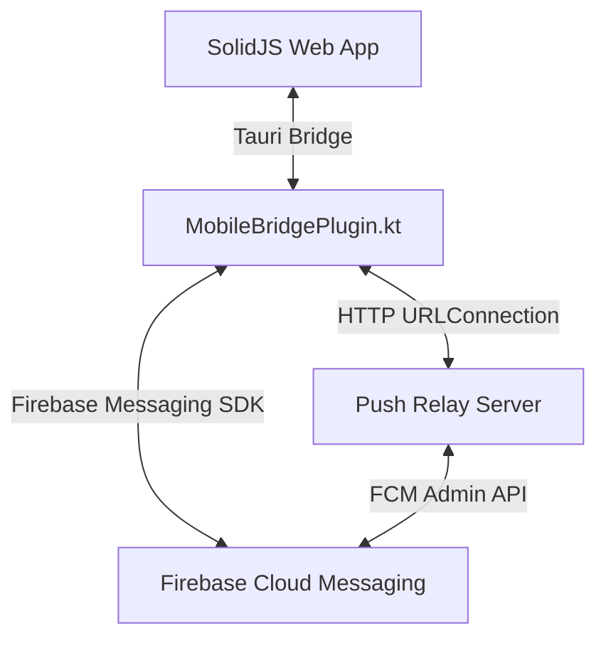

# Design Specification: Android Push Notifications (Simple Design)

This document outlines the design for integrating Android Push Notifications into the WhisperCode codebase using Firebase Cloud Messaging (FCM) as the backend, mirroring the design patterns used in the iOS implementation to keep frontend changes minimal.

---

## 1. Overview and Architecture

WhisperCode runs inside a Tauri WebView on mobile devices. The frontend application (SolidJS) communicates with the native Android layer (Kotlin) via the `mobile-bridge` Tauri plugin.



To maintain feature parity and avoid refactoring the SolidJS app's pairing context (`push-pair.tsx`), the Android push implementation mirrors the iOS bridge interfaces and state machine. The native Android layer will manage FCM token registration, pairing with the WhisperCode Push Relay, storing credentials, and displaying notifications.

---

## 2. Firebase Cloud Messaging (FCM) Integration

To enable FCM, the Android project (`packages/android/src-tauri/gen/android`) requires the Google Services plugin and FCM libraries.

### 2.1 Dependencies Configuration

#### [MODIFY] `packages/android/src-tauri/gen/android/build.gradle.kts`

The root project build configuration must include the Google Services classpath dependency:

```kotlin
buildscript {
    dependencies {
        classpath("com.google.gms:google-services:4.4.2")
    }
}
```

#### [MODIFY] `packages/android/src-tauri/gen/android/app/build.gradle.kts`

The application module must apply the Google Services plugin and implement the Firebase Bill of Materials (BOM) and FCM libraries:

```kotlin
plugins {
    id("com.android.application")
    id("org.jetbrains.kotlin.android")
    id("rust")
    id("com.google.gms.google-services")
}

dependencies {
    // ... existing dependencies ...
    implementation(platform("com.google.firebase:firebase-bom:33.1.1"))
    implementation("com.google.firebase:firebase-messaging-ktx")
}
```

### 2.2 Google Services Config File

Developers must download `google-services.json` from the Firebase Console and place it at `/packages/android/src-tauri/gen/android/app/google-services.json`.

### 2.3 Android Manifest Declarations

We configure the notification channel and the background messaging receiver in `/packages/android/src-tauri/gen/android/app/src/main/AndroidManifest.xml`:

```xml
<manifest xmlns:android="http://schemas.android.com/apk/res/android">
    <uses-permission android:name="android.permission.INTERNET" />
    <uses-permission android:name="android.permission.POST_NOTIFICATIONS" />

    <application>
        <!-- Custom Firebase Messaging Service -->
        <service
            android:name="ai.opencode.mobilebridge.WhisperFirebaseMessagingService"
            android:exported="false">
            <intent-filter>
                <action android:name="com.google.firebase.MESSAGING_EVENT" />
            </intent-filter>
        </service>

        <!-- Default channel for background notifications -->
        <meta-data
            android:name="com.google.firebase.messaging.default_notification_channel_id"
            android:value="opencode_notifications" />
    </application>
</manifest>
```

---

## 3. Kotlin MobileBridgePlugin.kt Commands

The native plugin `/packages/android/src-tauri/mobile-bridge/android/src/main/java/MobileBridgePlugin.kt` must implement the push management methods.

### 3.1 Preferences and Storage

To store pairing credentials securely on Android, `EncryptedSharedPreferences` or standard `SharedPreferences` is used. We define a helper class or method inside the plugin:

```kotlin
private const val PUSH_PREFS = "opencode.push.prefs"
private const val KEY_CHANNEL = "push.channel"
private const val KEY_DEVICE = "push.device"
private const val KEY_SECRET = "push.secret"
private const val KEY_RELAY = "push.relay_url"
private const val KEY_PAIR_ID = "push.pair_id"
private const val KEY_PAIR_TOKEN = "push.pair_token"
private const val KEY_PAIR_COMMAND = "push.pair_command"
private const val KEY_PAIR_EXPIRES = "push.pair_expires"
```

### 3.2 Command Implementations

#### getPushState

Returns the current registration and pairing status.

```kotlin
@Command
fun getPushState(invoke: Invoke) {
    val prefs = activity.getSharedPreferences(PUSH_PREFS, Context.MODE_PRIVATE)
    val hasToken = getCachedFCMToken() != null
    val hasPerm = ContextCompat.checkSelfPermission(activity, Manifest.permission.POST_NOTIFICATIONS) == PackageManager.PERMISSION_GRANTED

    val state = JSObject().apply {
        put("supported", true)
        put("permission", if (hasPerm) "authorized" else "not-determined")
        put("allowed", hasPerm)
        put("registered", hasToken)
        put("paired", prefs.getString(KEY_SECRET, null) != null)
        put("channel", prefs.getString(KEY_CHANNEL, null))
        // Add diagnostics similar to iOS
        put("diag", JSObject().apply {
            put("token", hasToken)
            put("relay", prefs.getString(KEY_RELAY, "https://whisper.clankercontext.com"))
            put("device", prefs.getString(KEY_DEVICE, null))
            put("pairID", prefs.getString(KEY_PAIR_ID, null))
        })
    }
    invoke.resolve(state)
}
```

#### requestPushPermission

Requests the runtime notification permission on API level 33+ (Android 13) and fetches the FCM registration token.

```kotlin
@Command
fun requestPushPermission(invoke: Invoke) {
    if (Build.VERSION.SDK_INT >= Build.VERSION_CODES.TIRAMISU) {
        ActivityCompat.requestPermissions(
            activity,
            arrayOf(Manifest.permission.POST_NOTIFICATIONS),
            PERMISSION_REQUEST_CODE
        )
        // Keep callback reference to resolve once authorized/denied
    }
    // Fetch FCM token asynchronously and resolve getPushState() payload
    FirebaseMessaging.getInstance().token.addOnCompleteListener { task ->
        if (task.isSuccessful) {
            saveFCMToken(task.result)
        }
        getPushState(invoke)
    }
}
```

#### beginPushPairing

Calls `/v1/pair/start` on the Push Relay with the FCM registration token.

```kotlin
@Command
fun beginPushPairing(invoke: Invoke) {
    val version = invoke.getString("version") ?: "unknown"
    val token = getCachedFCMToken() ?: return invoke.reject("missing_token")
    val relay = getRelayURL()

    val payload = JSObject().apply {
        put("apns_token", token) // Map FCM token to apns_token for relay compatibility
        put("device_name", Build.MODEL)
        put("app_version", version)
        put("apns_env", "production") // Or 'sandbox'
    }

    // Call Relay POST /v1/pair/start via HTTP Connection helper
    executeHttpRequest("$relay/v1/pair/start", "POST", payload) { response, error ->
        if (error != null) {
            invoke.reject(error)
        } else {
            // Save temporary pair details
            savePairDetails(response)
            invoke.resolve(response)
        }
    }
}
```

#### getPushPairing

Polls `/v1/pair/{id}` on the Relay to check if the host has claimed this device.

```kotlin
@Command
fun getPushPairing(invoke: Invoke) {
    val pairId = getPairID() ?: return invoke.reject("no_active_pairing")
    val relay = getRelayURL()

    executeHttpRequest("$relay/v1/pair/$pairId", "GET", null) { response, error ->
        if (error != null) {
            invoke.reject(error)
        } else {
            val status = response.getString("status")
            if (status == "active") {
                // Pair completed, store permanent credentials
                saveCredentials(
                    channel = response.getString("channel_id"),
                    device = response.getString("device_id"),
                    secret = response.getString("device_secret")
                )
                clearPairDetails()
            }
            invoke.resolve(response)
        }
    }
}
```

#### setPushCredentials

Explicitly sets the credentials (channel, device, secret).

```kotlin
@Command
fun setPushCredentials(invoke: Invoke) {
    val channel = invoke.getString("channel")
    val device = invoke.getString("device")
    val secret = invoke.getString("secret")

    saveCredentials(channel, device, secret)
    getPushState(invoke)
}
```

#### clearPushPairing

Calls `/v1/device` `DELETE` on the relay and purges local credentials.

```kotlin
@Command
fun clearPushPairing(invoke: Invoke) {
    val relay = getRelayURL()
    val auth = getAuthPayload()

    executeHttpRequest("$relay/v1/device", "DELETE", auth) { _, _ ->
        clearCredentials()
        clearPairDetails()
        getPushState(invoke)
    }
}
```

---

## 4. JS Bridge Mappings in packages/android/src/entry-android.tsx

We extend the SolidJS platform bridge in `packages/android/src/entry-android.tsx` to handle push methods identical to iOS.

```typescript
import { createSignal, onMount, onCleanup } from "solid-js"
import { type PairInfo, type PushState, type PushPrefs, type PushCred } from "@opencode-ai/app"

// Inside App component
const [push, setPush] = createSignal<PushState | undefined>()

const refreshPush = async () => {
  const result = await bridge.sendAsync<PushState>("getPushState")
  setPush(result)
  return result
}

// In platform configuration
const platform: Platform = {
  platform: "android",
  os: "android",
  version: pkg.version,

  // Existing fields ...

  pushState: push,
  getPushState: async () => refreshPush(),
  requestPushPermission: async () => {
    const result = await bridge.sendAsync<PushState>("requestPushPermission")
    setPush(result)
    return result
  },
  beginPushPairing: async () => {
    const result = await bridge.sendAsync<PairInfo>("beginPushPairing", { version: pkg.version })
    if (!result) throw new Error("Push pairing unavailable")
    return result
  },
  getPushPairing: async () => {
    const result = await bridge.sendAsync<PairInfo>("getPushPairing")
    return result ?? undefined
  },
  setPushPreferences: async (prefs: PushPrefs) => {
    await bridge.sendAsync("setPushPreferences", prefs)
  },
  setPushRelayURL: async (url?: string) => {
    await bridge.sendAsync("setPushRelayURL", { url })
  },
  openSystemSettings: async () => {
    await bridge.sendAsync("openSystemSettings")
  },
  testPush: async (href?: string) => {
    const result = await bridge.sendAsync<boolean>("testPush", { href })
    return result ?? false
  },
  setPushCredentials: async (input: PushCred) => {
    const result = await bridge.sendAsync<PushState>("setPushCredentials", input)
    setPush(result)
    return result
  },
  clearPushPairing: async () => {
    const result = await bridge.sendAsync<PushState>("clearPushPairing")
    setPush(result)
    return result
  },
}

// Inside onMount
onMount(() => {
  document.documentElement.dataset.platform = "android"
  void refreshPush()

  // Listener for token/credentials state changes from native side
  const stopPushState = bridge.on("pushStateChanged", (payload) => {
    setPush(payload as PushState)
  })

  // Listener for tapped notifications
  const stopPushOpened = bridge.on("pushOpened", (payload) => {
    const { href } = payload as { href?: string }
    if (href) {
      window.dispatchEvent(new CustomEvent("opencode:pushOpened", { detail: { href } }))
    }
  })

  onCleanup(() => {
    stopPushState()
    stopPushOpened()
  })
})
```

---

## 5. End-to-End Pairing & Delivery Flow

### 5.1 Simple Pairing Flow

1. **User requests pairing:** Frontend triggers `platform.requestPushPermission()`.
2. **Permission Check:** Android requests runtime permission `POST_NOTIFICATIONS` (API 33+).
3. **Token Generation:** Firebase SDK requests an FCM Registration Token.
4. **Initiating Pair:** JS calls `beginPushPairing()`. Native code issues a HTTP POST request `/v1/pair/start` to the relay with `apns_token: <FCM_TOKEN>`.
5. **Relay Response:** The relay returns a pairing ID (`pair_id`) and pairing command.
6. **CLI Run:** The user executes the pairing CLI command on the OpenCode host. The host contacts the relay and registers the channel keys for the device.
7. **Polling Completion:** The mobile app polls `/v1/pair/{id}` via `getPushPairing()`. Once pairing is claimed/active, the app receives the `channel_id`, `device_id`, and `device_secret` credentials.

### 5.2 Notification Display Flow

- **App In Foreground:** The Custom `WhisperFirebaseMessagingService` receives the FCM payload. If the user is active, the app suppresses visual notification display (or shows it only if forced) and fires a direct event or local notification to keep the UI in sync.
- **App In Background:** Firebase SDK/OS displays the notification tray alert. The payload contains `data` fields: `title`, `body`, and `href`.
- **Deep Linking / Notification Click:**
  - When a user taps the notification, the system launches or resumes `MainActivity` with an Intent carrying the `href` string.
  - In `MainActivity.onCreate` / `onNewIntent`, the Kotlin layer extracts the `href` parameter, caches it, and transmits it via `bridge.trigger("pushOpened", ...)` once the WebView is loaded.
